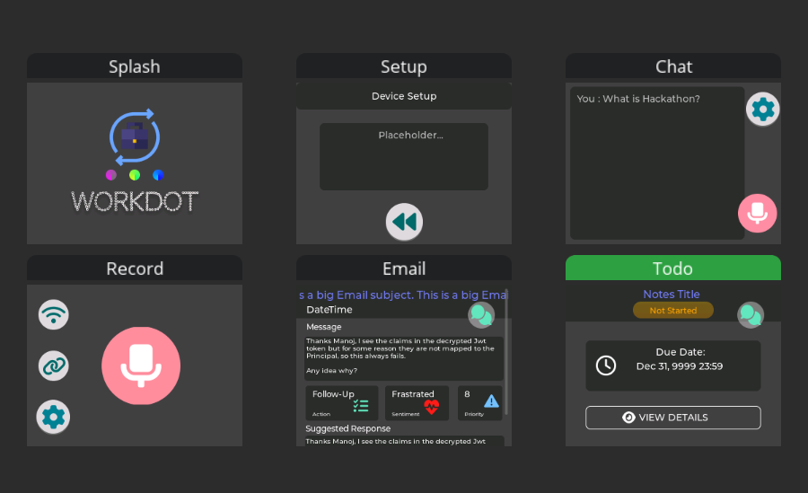
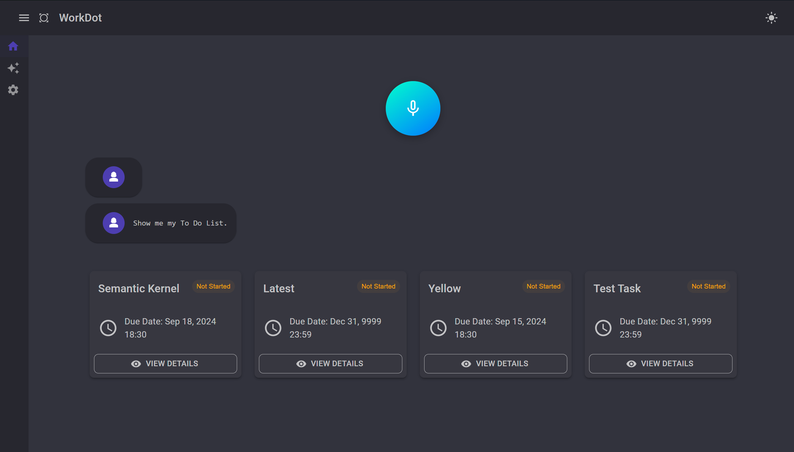

# WorkDot

WorkDot is a Embedded Device that enhances your work productivity with the power of AI.

## Background:
At the beginning of the year 2024, a new category of gadgets was introduced to the world – "Personal AI Devices." You might have come across innovations like the Rabbit R1 and Humane AI Pin. These devices promised to harness the power of AI through a “dedicated” and distraction-free platform, allowing users to get things done quickly. Imagine saying, “book a cab to the office,” and it’s handled in seconds. Tasks like ordering food, home automation, booking hotels, tickets, and countless other integrations were made possible through natural language interaction. Naturally, these devices also featured general AI chat capabilities.

This new category garnered a lot of attention for its potential. As a working professionals (and an Embedded System Enthusiast), we thought, why not create a similar device dedicated to work? Imagine commands like, “Schedule a meeting with a colleague,” “Analyze emails,” or “show me my to-do list.”

At the time of Development, Co-pilot/AI chat applications are still unavailable for platforms like Android Wear OS, presenting an exciting opportunity to explore how AI can empower compact, low-resource devices to efficiently perform work-related tasks with the same intelligence.

## Solution:
* WorkDot is an innovative embedded device designed to leverage AI for managing work data such as emails, to-do lists, and meetings.
* Despite its limited hardware resources (4 MB RAM), WorkDot connects to a cloud server to execute AI-powered voice commands. It can swiftly skim through vast amounts of work-related data, prioritize tasks, and deliver information in a distraction-free environment.
* Imagine you are in a Cab and say – “Plan my work today” and device shows of all your tasks prioritized, summarized, and presented in way you can catch up with all the items you need to do for the day. 
* Comes with a Desktop companion for setup and reviewing conversation history.

Glimpse of the UI Project:

Desktop App:

## Demo

<video controls width="600">
  <source src="https://raw.githubusercontent.com/mndxt007/WorkDot/master/Resources/Work.mp4" type="video/mp4">
</video>

https://raw.githubusercontent.com/mndxt007/WorkDot/master/Resources/Work.mp4

## Extra Details for Hackers/DIYers out there:

* We chose to use the [M5Stack Core2 ESP32 IoT Development Kit | m5stack-store](https://shop.m5stack.com/products/m5stack-core2-esp32-iot-development-kit) which is a module comes bundled with most hardware needed for such a device:
    -   [ESP32](https://shop.m5stack.com/)-based, built-in Bluetooth/Wi-Fi
    -   16M Flash,8M PSRAM (sounds very less isn't it 😊)
    -   Built-in speaker, power indicator, vibration motor, RTC, I2S amplifier, capacitive touch screen, power button, reset button
    -   TF card slot (16G Maximum size)
    -   Built-in lithium battery, equipped with power management chip
-   Building the embedded software was a huge challenge. Recording the audio while simultaneous sending the chucks to Web socket, learnt a lot about Embedded Software. Some of the key takeaways:
    -   Web Socket Protocol (especially continuation frames) - [RFC 6455 - The WebSocket Protocol (ietf.org)](https://datatracker.ietf.org/doc/html/rfc6455#section-5.2)
        -   Had to modify the library code to support this -- [WebSocketsClient.cpp](./WorkDot.M5Stack/src/WebSockets/WebSockets.cpp)
    -   Using Tasks in RTOS:
            -   [FreeRTOS - ESP32 - --- ESP-IDF Programming Guide v4.3 documentation (espressif.com)](https://docs.espressif.com/projects/esp-idf/en/v4.3/esp32/api-reference/system/freertos.html)
            -   [RTOS Fundamentals - FreeRTOS™](https://www.freertos.org/Documentation/01-FreeRTOS-quick-start/01-Beginners-guide/01-RTOS-fundamentals)
            -   [Main.cpp)](./WorkDot.M5Stack/src/Main.cpp)
        -   Using Task Synchronization:
        -   [xSemaphoreTake - FreeRTOS™](https://www.freertos.org/Documentation/02-Kernel/04-API-references/10-Semaphore-and-Mutexes/12-xSemaphoreTake)
        -   [FreeRTOS - ESP32 - --- ESP-IDF Programming Guide v5.0 documentation (espressif.com)](https://docs.espressif.com/projects/esp-idf/en/v5.0/esp32/api-reference/system/freertos.html#queue-api)
    -   UI Library for Embedded Systems:
        -   [LVGL --- Light and Versatile Embedded Graphics Library](https://lvgl.io/)
        -   Using SquareLine Studio + Figma as UI Development Tool (paid tool offers 30 day trail) - [SquareLine Studio - Design and build UIs with ease](https://squareline.io/)

-   Now of course, the backend needs to the heavy lifting:
    -   Asp.Net WebSockets - [WebSockets support in ASP.NET Core | Microsoft Learn](https://learn.microsoft.com/en-us/aspnet/core/fundamentals/websockets?view=aspnetcore-8.0)
    -   Speech SDK for Speech to Text - [About the Speech SDK - Speech service - Azure AI services | Microsoft Learn](https://learn.microsoft.com/en-us/azure/ai-services/speech-service/speech-sdk)
    -   Semantic Kernel for AI Orchestration - [Function calling with chat completion | Microsoft Learn](https://learn.microsoft.com/en-us/semantic-kernel/concepts/ai-services/chat-completion/function-calling/?pivots=programming-language-csharp)
    -   Graph SDK for retrieving data - [Microsoft Graph SDK overview - Microsoft Graph | Microsoft Learn](https://learn.microsoft.com/en-us/graph/sdks/sdks-overview)
    -   Projects:
        -   Services - [WorkDot.Services](./WorkDot.Services/)
        -   Backend API - [WorkDot.Api](./WorkDot.Api/)
        -   MAUI Based Desktop Companion - [WorkDot.Desktop](./WorkDot.Desktop/)

## Impact:
* By introducing AI capabilities to minimal hardware, WorkDot showcases the potential of embedded devices to significantly improve productivity.
* It allows users to interact with their work data in a seamless, hands-free manner, making complex task management more intuitive and accessible.
* This opens up new possibilities for expanding AI’s reach to a wider array of devices, including wearable technology, and demonstrates how AI can enhance even the most resource-constrained platforms.

## Future
* The next steps involve refining the WorkDot’s AI capabilities to process a broader range of work data sources, improving voice recognition accuracy, and optimizing the desktop companion for better integration with third-party applications.
* Additionally, expanding its customizable widgets and ensuring compatibility with more enterprise software platforms will further increase the device’s utility in diverse work environments.

